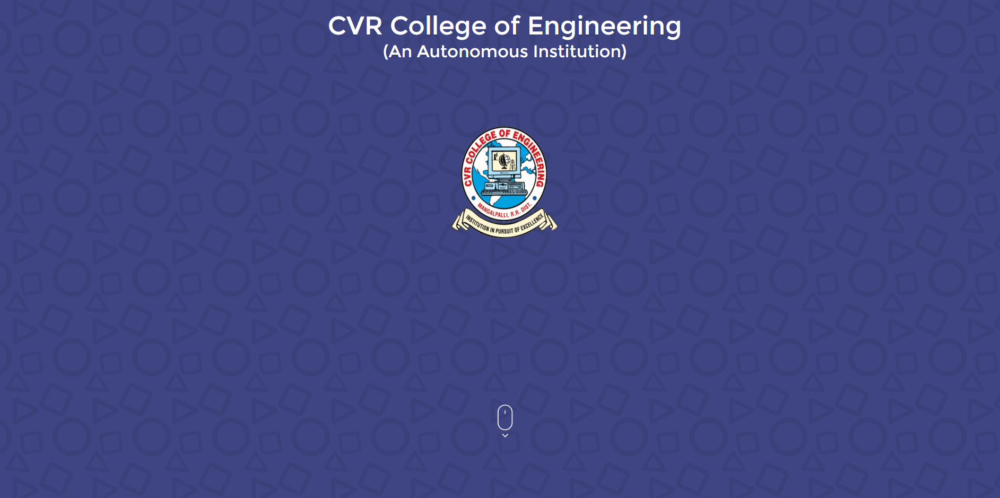
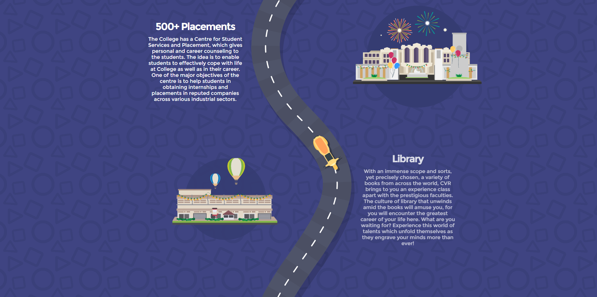
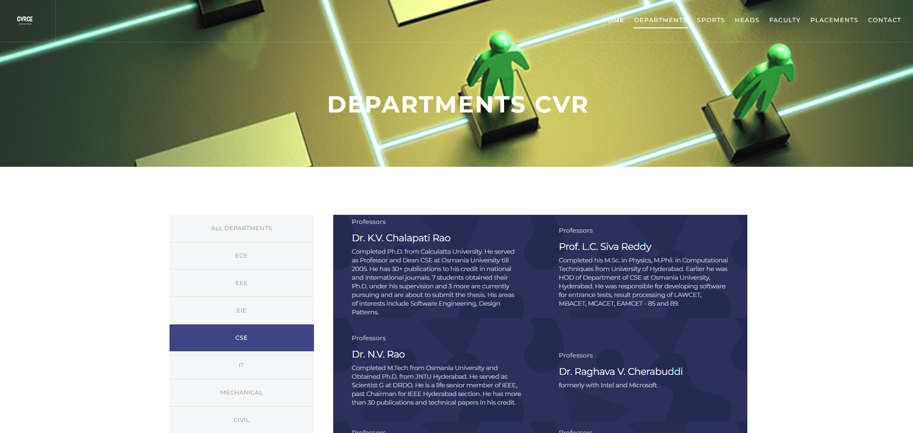
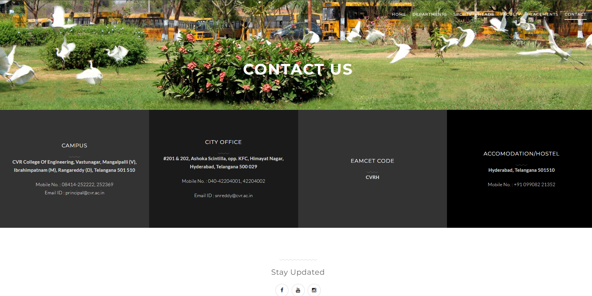

# CVR College of Engineering TechFast Symposium Website

This is the official website for the **TechFast Symposium** hosted by **CVR College of Engineering**. The website is built using **HTML, CSS, and JavaScript**, featuring a custom **bike animation on an SVG road that moves on scroll**, which adds a cool interactive effect.

## 🚀 Features
- **Modern UI/UX** with a responsive layout.
- **SVG Bike Animation** that moves along a road when scrolling.
- **Custom JavaScript** for smooth animations.
- **External JS libraries** used for additional features.
- **Hosted Live on GitHub Pages**.

## 📸 Screenshots

### Home Page


### Bike Transition


### Departments


### Contact Us


### Heads


## 📂 Project Structure
```
/techfast-symposium
│── index.html        # Main landing page
│── css/              # Custom styling
│── js/               # Main JavaScript files
│── html/             # Other HTML Pages
│── files/            # Images, icons, and media files
│── README.md         # This file
```

## 🔧 Setup & Installation
1. Clone this repository:
   ```sh
   git clone https://github.com/tan-nandam/symposium-website.git
   ```
2. Open `index.html` in a browser to view the website.

## 🌍 Live Demo
Check out the website live on **GitHub Pages**:  
🔗 [Live Demo](https://tan-nandam.github.io/symposium-website/)

## 📜 License
This project is open-source and available under the MIT License.

---

💡 *Developed with passion for the TechFast Symposium at CVR College of Engineering.*
